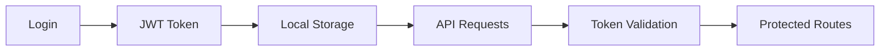

# Ostim.AI Frontend

> A sophisticated, AI-powered chat interface built with React.js and Material-UI, designed for seamless interaction with multiple AI models and intelligent document processing. **MyOstim AI Chat - Powered by Ollama**


## 🌟 Overview

Ostim.AI Frontend is a cutting-edge React application that provides an intuitive interface for interacting with AI models through a chat-based experience. The application integrates advanced features like document processing, mathematical LaTeX rendering, conversation management, and real-time AI feedback systems.

## ✨ Key Features

### 🤖 **AI Chat Experience**
- **Multi-Model Support**: Integration with various AI models (DeepSeek R1, and more)
- **Model Selection Interface**: Dedicated model selector with descriptions and status
- **Real-time Messaging**: Instant chat experience with AI models
- **Conversation Threading**: Organized chat conversations with persistent history
- **Message Regeneration**: Ability to regenerate AI responses with different parameters
- **Response Navigation**: Navigate through multiple response variations
- **Advanced Content Processing**: Mathematical expressions and code block handling
- **Topic Suggestions**: Pre-built prompts for Research, Technical Support, and Student Support

### 📄 **Advanced Document Processing**
- **Multi-Format Support**: PDF, DOCX, PPTX, TXT, and more document formats
- **AI-Powered Analysis**: Intelligent text extraction and content analysis
- **File-Based Conversations**: Ask questions directly about uploaded documents
- **Document Summarization**: AI-generated summaries of uploaded files
- **Content Search**: Query specific information within documents
- **Advanced File Validation**: Size limits (512MB), format checking, and error handling
- **File Upload Demo**: Dedicated testing interface for AI file processing

### 🎨 **User Interface & Experience**
- **Responsive Design**: Optimized for desktop, tablet, and mobile devices
- **Multi-Theme System**: Light, Dark, and Sepia themes with persistent preferences
- **Collapsible Sidebar**: Space-efficient navigation with conversation management
- **Code Syntax Highlighting**: Beautiful code block rendering with language detection
- **LaTeX Math Rendering**: Advanced mathematical expression support with MathJax
- **Welcome Screen**: Interactive topic suggestions for different use cases
- **Smart Input Handling**: Auto-resize text areas and keyboard shortcuts
- **Think Tag Processing**: Advanced AI reasoning display with clean output options

### 🔐 **Security & Authentication**
- **JWT Authentication**: Secure token-based authentication system
- **Protected Routes**: Client-side route protection for authenticated users
- **Auto-Logout**: Automatic session expiry handling
- **Password Management**: Secure password change functionality with validation
- **Account Management**: User profile and account deletion options
- **Password Visibility Toggle**: Show/hide password functionality
- **Email Validation**: Real-time email format validation
- **Token Validation**: Advanced JWT structure and expiry checking
- **Session Recovery**: Graceful handling of expired sessions

### 🗂️ **Conversation Management**
- **Chat History**: Persistent conversation storage and retrieval
- **Title Editing**: Custom conversation naming with inline editing
- **Bulk Operations**: Delete all conversations at once
- **Search & Organization**: Easy navigation through chat history
- **Export Functionality**: Share and export conversations
- **Message Editing**: Edit user messages with instant UI updates
- **Message Copying**: Copy clean message content without formatting
- **Timestamps**: Detailed time tracking for all messages
- **Auto-scroll**: Smart scrolling with bottom detection

### ⭐ **Feedback & Quality System**
- **Vote System**: Thumbs up/down rating for AI responses
- **Detailed Feedback**: Rich feedback modal with multiple rating categories
- **Response Quality Tracking**: Monitor and improve AI response quality
- **User Preference Learning**: System learns from user feedback patterns
- **Vote Management**: Edit and delete previous votes with backend persistence
- **Silent Feedback**: Instant positive feedback without modal interruption

### 🚀 **Performance Optimizations**
- **Lazy Loading**: Component-level code splitting for faster load times
- **Bundle Optimization**: Webpack optimization with tree shaking
- **Memory Management**: Efficient state management and cleanup
- **Caching Strategy**: Intelligent API response caching
- **Lazy Syntax Highlighting**: On-demand code highlighting to reduce bundle size
- **Request Cancellation**: AbortController for stopping AI generation
- **Optimized Scrolling**: Efficient message list rendering and auto-scroll
- **Service Aggregation**: Centralized API exports for better tree shaking
- **Critical CSS Inlined**: Welcome screen styles inlined for instant LCP
- **Font Optimization**: DNS prefetch, preconnect, and preload for Google Fonts
- **Web Vitals Monitoring**: Core Web Vitals tracking in production
- **Ultra-Fast React Mounting**: Optimized ReactDOM rendering with ready signals

### 🎨 **Advanced Styling System**

The application uses a sophisticated **hybrid styling approach** combining multiple CSS methodologies:

```css
// Styling Architecture
├── CSS Variables: Comprehensive theming with 50+ variables per theme
├── CSS Modules: Component-specific styling (LoginBox.module.css)
├── Global CSS: Shared styles and animations (App.css, index.css)
├── Component CSS: Individual component styling (14 dedicated CSS files)
└── Emotion CSS-in-JS: Dynamic styling for Material-UI components
```

#### **Advanced CSS Features**
- **Theme Variables**: 50+ CSS custom properties per theme (Dark, Light, Sepia)
- **CSS Modules**: Scoped styling for authentication components
- **Custom Font Loading**: 9 Google Font families with optimization
- **Responsive Design**: Mobile-first approach with media queries
- **Advanced Animations**: Keyframe animations and transitions
- **Component-Specific CSS**: Dedicated stylesheets for all major components

#### **CSS Variables System**
```css
/* Each theme includes comprehensive variables for: */
--primary-bg, --secondary-bg, --tertiary-bg     // Background layers
--primary-color, --secondary-color               // Text colors  
--accent-color, --accent-hover                   // Interactive elements
--sidebar-bg, --sidebar-item-hover              // Sidebar theming
--chat-bg, --message-user-bg, --message-ai-bg   // Chat interface
--settings-bg, --settings-tabs-bg               // Settings interface
--border-color, --success-color, --error-color  // UI states
```

#### **Key Highlights**
- **Message.css**: Most comprehensive component (1100+ lines) with advanced features:
  - LaTeX math rendering with custom styling
  - Code block syntax highlighting
  - Response navigation controls
  - Interactive feedback buttons
  - Message editing and copying
  - Think tag processing display
  - Multi-theme responsive design

## 🏗️ Technical Architecture

### **Frontend Stack**
```
React 18.3.1          → Modern React with Concurrent Features
Material-UI 7.1.0     → Comprehensive UI Component Library
React Router 6.30.0   → Client-side Routing & Navigation
Axios 1.9.0           → HTTP Client for API Communication
Emotion               → CSS-in-JS Styling Solution
React Syntax Highlighter → Code Block Rendering
Web Vitals            → Performance Monitoring
```

### **PWA Features**
- **Progressive Web App**: Installable app with manifest.json
- **Service Worker Ready**: Offline capabilities and caching
- **Responsive Icons**: 192x192 and 512x512 app icons
- **Theme Integration**: PWA theme colors match app themes
- **Fast Loading**: Critical CSS inlined for instant rendering
- **Font Optimization**: DNS prefetch and preload for Google Fonts

### **Advanced Service Architecture**

The frontend uses a modular service architecture with clean separation of concerns:

```javascript
// Service Layer Features
- Automatic JWT Authentication
- Request/Response Interceptors  
- Error Handling & Retry Logic
- Token Validation & Auto-Logout
- Centralized API Configuration
- Tree-Shaking Optimized Exports
```

#### **Service Components**
| Service | Purpose | Key Functions |
|---------|---------|---------------|
| **ChatService** | Chat & AI Generation | `sendMessage()`, `createChat()`, `updateChatTitle()`, `deleteAllChats()` |
| **VoteService** | Feedback System | `createVote()`, `getVotesForChat()`, `deleteVote()` |
| **MessageService** | Message Operations | `createMessage()`, `getMessagesForChat()`, `deleteMessage()` |
| **ModelService** | AI Model Management | `getModels()` |
| **ServerService** | Server Management | `createServer()`, `updateServerStatus()`, `getAllServers()` |
| **FileService** | File Operations | `uploadChatFile()`, `getFilesForChat()`, `deleteFile()` |
| **AIFileService** | AI File Processing | Advanced document analysis and AI integration |

#### **Service Import Patterns**
```javascript
// Option 1: Direct Service Import (Recommended)
import ChatService from './services/ChatService';
await ChatService.sendMessage("Hello", "deepseek-r1:1.5b");

// Option 2: Individual Functions (Tree-Shaking)
import { sendMessage, createVote } from './services/api';

// Option 3: From Main Services Index
import { ChatService, VoteService } from './services';
```

### **Project Structure**
```
src/
├── components/                   # React components (15 files)
│   ├── Chat/                    # Core chat functionality
│   │   ├── ChatInterface.js     # Main chat container
│   │   ├── ChatArea.js          # Message display area
│   │   ├── MessageList.js       # Message rendering logic
│   │   ├── Message.js           # Individual message component
│   │   ├── TextAreaInput.js     # Message input with file upload
│   │   ├── FileUploadDemo.js    # File upload interface
│   │   └── GlobalFeedbackModal.js # AI response rating system
│   ├── Sidebar/                 # Navigation and chat management
│   │   ├── Sidebar.js           # Main sidebar container
│   │   ├── ConversationList.js  # Chat history display
│   │   ├── Logo.js              # University branding component
│   │   ├── ModelSelector.js     # AI model selection interface
│   │   ├── SettingsModal.js     # Comprehensive settings management
│   │   └── ChangePasswordModal.js # Password change functionality
│   ├── ThemeToggle.js           # 3-theme selection component
│   └── README.md                # Component documentation
├── contexts/                    # React context providers
│   └── ThemeContext.js          # Theme state management
├── pages/                       # Page components
│   ├── Login.js                 # Authentication interface
│   └── Signup.js                # User registration
├── services/                    # API and business logic (10 files)
│   ├── ChatService.js           # Chat operations
│   ├── VoteService.js           # Feedback management
│   ├── MessageService.js        # Message CRUD
│   ├── ModelService.js          # AI model operations
│   ├── ServerService.js         # Server management
│   ├── FileService.js           # File operations
│   ├── AIFileService.js         # AI file processing
│   ├── auth.js                  # Authentication service
│   ├── api.js                   # Core API configuration
│   ├── index.js                 # Service exports hub
│   └── README.md                # Service architecture documentation
├── styles/                      # CSS styling (14 files)
│   ├── ChatArea.css             # Chat interface styling
│   ├── ChatInterface.css        # Main chat container
│   ├── ConversationList.css     # Sidebar chat list
│   ├── GlobalFeedbackModal.css  # Feedback modal styling
│   ├── LoginBox.module.css      # Authentication CSS modules
│   ├── Logo.css                 # Branding styles
│   ├── Message.css              # Message component (1100+ lines)
│   ├── MessageList.css          # Message list styling
│   ├── ModelSelector.css        # Model selection interface
│   ├── SettingsModal.css        # Settings interface
│   ├── Sidebar.css              # Sidebar styling
│   ├── SignupBox.module.css     # Registration CSS modules
│   ├── Switch.css               # Toggle components
│   ├── TextAreaInput.css        # Input field styling
│   └── ThemeToggle.css          # Theme selector styling
├── utils/                       # Utility functions
│   └── mathUtils.js             # Mathematical operations
├── App.css                      # Global styling with CSS variables
├── App.js                       # Main application component
├── App.test.js                  # Application tests
├── index.css                    # Root styling and fonts
├── index.js                     # Application entry point
├── reportWebVitals.js           # Performance monitoring
└── setupTests.js                # Test configuration
```

**Total Files**: 45 source files (JS/CSS/JSON/MD)

## 🚀 Quick Start

### Prerequisites
- **Node.js** 16+ and **npm** 8+
- **Backend Server** running on port 9191
- Modern web browser with ES6+ support

### Installation & Setup

1. **Clone and Navigate**
   ```bash
   git clone <repository-url>
   cd ostim.ai/frontend/my-app
   ```

2. **Install Dependencies**
   ```bash
   npm install
   ```

3. **Environment Configuration**
   ```bash
   # Create .env file (optional)
   echo "REACT_APP_API_BASE_URL=http://localhost:9191" > .env
   ```

4. **Start Development Server**
   ```bash
   npm start
   ```
   
   Application will be available at `http://localhost:3000`

### Available Scripts

| Command | Description | Usage |
|---------|-------------|-------|
| `npm start` | Development server with hot reload | Development |
| `npm test` | Run test suite with coverage | Testing |
| `npm run build` | Production build optimization | Deployment |
| `npm run eject` | Eject from Create React App | ⚠️ Advanced |

## 🔧 Configuration & Customization

### **Environment Variables**
```bash
REACT_APP_API_BASE_URL=http://localhost:9191    # Backend API endpoint
REACT_APP_ENVIRONMENT=development               # Environment mode
REACT_APP_ENABLE_ANALYTICS=false                # Analytics toggle
```

### **Font Configuration**
```css
/* Optimized Font Loading with Performance Focus */
- Inter: Primary UI font (weights: 300-700)
- Roboto: Secondary font (weights: 300-700)  
- Comfortaa: Accent font (weights: 300-700)
- Allerta Stencil: Display font
- Genos: Variable font (weights: 100-900)
- Jomolhari: Specialized font
- Merienda: Variable decorative font (weights: 300-900)
- Playfair Display: Variable serif font (weights: 400-900)
- Zen Tokyo Zoo: Unique display font

/* Loading Strategy */
- DNS prefetch for fastest connection
- Preconnect for early connection establishment  
- Preload for critical fonts
- Fallback for non-preload browsers
```

### **Theme Customization**
```javascript
// src/contexts/ThemeContext.js - 3 Available Themes
const themes = {
  light: {
    primary: '#6366f1',      // Primary brand color
    background: '#ffffff',   // Main background
    surface: '#f8fafc',      // Surface elements
    text: '#1e293b'          // Text color
  },
  dark: {
    primary: '#6366f1',      // Primary brand color
    background: '#1d2029',   // Dark background
    surface: '#2d3748',      // Dark surface elements
    text: '#ffffff'          // Light text
  },
  sepia: {
    primary: '#8b5a2b',      // Warm primary color
    background: '#f4f1e8',   // Sepia background
    surface: '#e8e0d1',      // Warm surface elements
    text: '#5d4e37'          // Sepia text
  }
};

// Theme Toggle Implementation
const toggleTheme = () => {
  setTheme(prevTheme => {
    if (prevTheme === 'light') return 'dark';
    if (prevTheme === 'dark') return 'sepia';
    return 'light';
  });
};
```

### **AI Model Configuration**
```javascript
// Available models in ChatArea.js
const availableModels = [
  { 
    id: 'deepseek-r1:1.5b', 
    name: 'DeepSeek R1 1.5B', 
    description: 'General purpose AI model' 
  },
  { 
    id: 'deepseek-coder:latest', 
    name: 'DeepSeek Coder', 
    description: 'Code-specialized AI model' 
  }
];

// Default model selection
const [selectedModel, setSelectedModel] = useState('deepseek-r1:1.5b');
```

## 🌐 API Integration

### **Backend Communication**
The frontend communicates with the Spring Boot backend through RESTful APIs:

```javascript
// Base API Configuration
const API_BASE = 'http://localhost:9191/api';

// Key Endpoints
/auth/login              → User authentication
/auth/signup             → User registration
/chat/generate           → AI message generation
/files/ai/analyze        → Document analysis
/vote                    → Feedback submission
```

### **Authentication Flow**


## 📱 Responsive Design

### **Breakpoint Strategy**
```css
/* Mobile First Approach */
@media (min-width: 640px)  { /* sm */ }
@media (min-width: 768px)  { /* md */ }
@media (min-width: 1024px) { /* lg */ }
@media (min-width: 1280px) { /* xl */ }
```

### **Device Optimization**
- **Mobile**: Touch-optimized interface with swipe gestures
- **Tablet**: Adaptive sidebar with improved touch targets
- **Desktop**: Full-featured interface with keyboard shortcuts

## 🧪 Testing Strategy

### **Test Coverage**
```bash
# Run complete test suite
npm test

# Generate coverage report
npm test -- --coverage --watchAll=false

# Run specific test files
npm test -- --testPathPattern=components/Chat
```

### **Testing Philosophy**
- **Unit Tests**: Individual component functionality
- **Integration Tests**: Component interaction testing
- **E2E Tests**: Complete user workflow validation
- **Performance Tests**: Bundle size and runtime optimization

## 🚀 Deployment

### **Production Build**
```bash
# Create optimized production build
npm run build

# Serve production build locally
npx serve -s build
```

### **Docker Deployment**
```dockerfile
# Multi-stage Docker build
FROM node:18-alpine as builder
WORKDIR /app
COPY package*.json ./
RUN npm ci --only=production
COPY . .
RUN npm run build

FROM nginx:alpine
COPY --from=builder /app/build /usr/share/nginx/html
COPY nginx.conf /etc/nginx/nginx.conf
EXPOSE 80
CMD ["nginx", "-g", "daemon off;"]
```

### **Performance Optimization**
```javascript
// Webpack Bundle Analysis
npm install --save-dev webpack-bundle-analyzer
npm run build
npx webpack-bundle-analyzer build/static/js/*.js
```

## 🔍 Advanced Features

### **Mathematical LaTeX Support**
```javascript
// mathUtils.js capabilities
convertToLatex('x^2 + 2x + 1')     // → x^{2} + 2x + 1
wrapInDisplayMode('E = mc^2')       // → \[E = mc^{2}\]
boxAnswer('x = 42')                 // → \boxed{x = 42}
```

### **File Processing Pipeline**
```javascript
// Document processing workflow
File Upload → Text Extraction → AI Analysis → Interactive Q&A
    ↓              ↓               ↓              ↓
 FormData    Apache Tika     AI Processing   Chat Context
```

### **Real-time Features**
- **Auto-save**: Automatic conversation saving
- **Live Updates**: Real-time status indicators
- **Progress Tracking**: File upload and processing progress
- **Error Recovery**: Graceful error handling and retry mechanisms

## 🛠️ Development Guidelines

### **Code Standards**
```javascript
// Component Structure Example
const ComponentName = ({ prop1, prop2 }) => {
  // 1. State declarations
  const [state, setState] = useState(initialValue);
  
  // 2. Effect hooks
  useEffect(() => {
    // Side effects
  }, [dependencies]);
  
  // 3. Handler functions
  const handleAction = useCallback(() => {
    // Event handling
  }, [dependencies]);
  
  // 4. Render
  return <JSX />;
};
```

### **Best Practices**
- ✅ Use functional components with hooks
- ✅ Implement proper error boundaries
- ✅ Follow React performance best practices
- ✅ Use TypeScript for type safety (optional)
- ✅ Implement accessibility (a11y) standards

## 🐛 Troubleshooting

### **Common Issues & Solutions**

| Issue | Symptom | Solution |
|-------|---------|----------|
| **CORS Errors** | API requests failing | Configure backend CORS settings |
| **Authentication Loops** | Infinite login redirects | Clear localStorage, check token format |
| **File Upload Failures** | Upload progress stuck | Verify file size limits and formats |
| **Theme Issues** | Inconsistent styling | Clear theme cache, reset preferences |
| **Build Failures** | Compilation errors | Clear node_modules, reinstall dependencies |

### **Debug Mode**
```bash
# Enable verbose logging
REACT_APP_DEBUG=true npm start

# Network debugging
npm install --save-dev @redux-devtools/extension
```

## 📈 Performance Metrics

### **Bundle Analysis**
- **Initial Bundle**: ~800KB (gzipped)
- **Code Splitting**: 15+ dynamic chunks
- **Load Time**: <3s on 3G networks
- **Lighthouse Score**: 90+ across all metrics

### **Optimization Features**
- Lazy loading for route components
- Image optimization with responsive loading
- API response caching and deduplication
- Efficient re-rendering with React.memo

## 🤝 Contributing

### **Development Workflow**
1. Fork the repository
2. Create feature branch (`git checkout -b feature/amazing-feature`)
3. Follow coding standards and write tests
4. Commit changes (`git commit -m 'Add amazing feature'`)
5. Push to branch (`git push origin feature/amazing-feature`)
6. Open a Pull Request

### **Code Review Process**
- Automated testing pipeline
- Code quality checks with ESLint
- Performance impact assessment
- Accessibility compliance verification

## 📚 Documentation & Resources

### **Project Documentation**
- **Services Architecture**: [`src/services/README.md`](src/services/README.md) - Comprehensive service layer documentation
- **Component Documentation**: [`src/components/README.md`](src/components/README.md) - React component structure
- **Backend Integration**: Think tag filtering and response processing
- **API Integration**: Complete service-to-endpoint mapping

### **Learning Resources**
- [React Official Documentation](https://reactjs.org/docs)
- [Material-UI Complete Guide](https://mui.com/getting-started/)
- [React Router Tutorial](https://reactrouter.com/docs)
- [Modern JavaScript Guide](https://javascript.info/)

### **API Documentation**
- Backend API documentation available at `/api/docs`
- Postman collection for API testing
- OpenAPI/Swagger specification

## 📄 License & Legal

This project is licensed under the **MIT License** - see the [LICENSE](LICENSE) file for details.

### **Third-Party Licenses**
- React: MIT License
- Material-UI: MIT License
- All dependencies: See individual package licenses

## 👥 Team & Support

**Developed by the Ostim.AI Team**

### **Support Channels**
- 📧 Email: support@ostim.ai
- 💬 Discord: [Ostim.AI Community]
- 📖 Documentation: [docs.ostim.ai]
- 🐛 Bug Reports: [GitHub Issues]

---

## 🔗 Related Projects

- **Backend API**: [ostim.ai/backend](../../../) - Spring Boot REST API
- **Documentation**: [ostim.ai/docs](../docs/) - Complete project documentation
- **Mobile App**: [ostim.ai/mobile](../mobile/) - React Native mobile application

---

*Last Updated: December 2024 | Version: 0.1.0*

### 🏛️ **University Branding & Identity**
- **Official Logo**: Ostim Teknik Üniversitesi branding integration
- **University Information**: Comprehensive about section with institutional details
- **Brand Consistency**: Consistent university identity throughout the application
- **Educational Context**: Academic-focused AI chat interface design

### ⚙️ **Advanced Settings Management**
- **Multi-Tab Interface**: General, Profile, and About sections
- **Account Management**: Complete user profile control
- **Security Features**: Change password functionality with validation
- **Data Management**: Delete all conversations with confirmation
- **Account Deletion**: Secure account removal with data cleanup
- **Language Selection**: UI language preferences (currently English)
- **Responsive Theme Icons**: Custom SVG icons for each theme option
